## Introduction

`VaspBandUnfolding` consists of a collection of python scripts that deal with `VASP` output files. 

- `vaspwfc.py` can be used to read the plane-wave coefficients in the `WAVECAR` file and then generate real-space representation of the pseudo-wavefunction by Fourier transform. Other wavefunction related quantites, e.g. transition dipole moment (pseudo-wavefunction part), inverse participation ratio and electron localization function et al. can also be conveniently obtained.

  Moreover, a command line tool named `wfcplot` in the `bin` directory can be used to output real-space pseudo-wavefunctions.

- `paw.py` can be used to parse the PAW `POTCAR` file. A command line tool named `potplot` in the `bin` directory can be used to visualize the projector function and partial waves contained in the `POTCAR`.

- `aewfc.py` can be used to generate all-electron (AE) wavefunction. 

- `unfold.py` can be used to perform band unfolding from supercell calculations.

## Installation

-  Requirements

    * Numpy
    * Scipy
    * Matplotlib
    * ASE
    * [pySBT](https://github.com/QijingZheng/pySBT) for spherical Bessel transform


- Manual Installation

  ```bash
  git clone https://github.com/QijingZheng/VaspBandUnfolding
  # set the 
  cd VaspBandUnfolding
  python setup.py install --prefix=/the/path/of/your/dir/
  export PYTHONPATH=/the/path/of/your/dir:${PYTHONPATH}
  ```


- Using Pip

  ```bash
  pip install git+https://github.com/QijingZheng/VaspBandUnfolding
  ```


## Examples

### Reading VASP WAVECAR

- Pseudo-wavefunction.

  As is well known, `VASP` `WAVECAR` is a binary file and contains the plane-wave coefficients for the pseudo-wavefunctions. The pseudo-wavefunction in real space can be obtained by 3D Fourier transform on the plane-wave coefficients and represented on a 3D uniform grid which can be subsequently visualized with software such as `VESTA`.

  - For a normal `WAVECAR`, i.e. not *gamma-only* or *non-collinear* `WAVECAR`, one can write a small python script and convert the desired Kohn-Sham states to real space.
  
    ```python
    #/usr/bin/env python
    from vaspwfc import vaspwfc
    
    pswfc = vaspwfc('./examples/wfc_r/WAVECAR')
    # KS orbital in real space, double the size of the FT grid
    phi = pswfc.get_ps_wfc(ikpt=2, iband=27, ngrid=pswfc._ngrid * 2)
    # Save the orbital into files. Since the wavefunction consist of complex
    # numbers, the real and imaginary part are saved separately.
    pswfc.save2vesta(phi, poscar='./examples/wfc_r/POSCAR')
    ```

    - In the above script, `pswfc._ngrid` is the default 3D grid size and `phi` is a numpy 3D array of size `2*pswfc._ngrid`, with the first dimensiton being *x* and the last "z".
    - The *spin*, *k-point* and *band* index for the KS state are designated by the argumnt `ispin`, `ikpt` and  `iband`, respectively, all of which start from `1`.
    - Generally, the pseudo-wavefunction is complex, `pswfc.save2vesta` will export both the *real* and *imaginary* part of the wavefunction, with the file name "wfc_r.vasp" and "wfc_i.vasp", respectively.

    Below are the real (left) and imaginary (right) part of the selected KS orbital:

    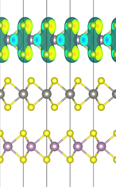 
    


  - For *gamma-only* `WAVECAR`, one must pass the argument `lgamma=True`  when reading `WAVECAR` in the `vaspwfc` method. Moreover, as `VASP` only stores half of the full plane-wave coefficients for *gamma-only* WAVECAR and `VASP` changes the idea about which half to save from version 5.2 to 5.4. An addition argument must be passed.

    ```python
    #/usr/bin/env python
    from vaspwfc import vaspwfc
    
    # For VASP <= 5.2.x, check
    # which FFT VASP uses by the following command:
    #
    #     $ grep 'use.* FFT for wave' OUTCAR
    #
    # Then
    #
    #     # for parallel FFT, VASP <= 5.2.x
    #     pswfc = vaspwfc('WAVECAR', lgamma=True, gamma_half='z')
    #
    #     # for serial FFT, VASP <= 5.2.x
    #     pswfc = vaspwfc('WAVECAR', lgamma=True, gamma_half='x')
    #
    # For VASP >= 5.4, WAVECAR is written with x-direction half grid regardless of
    # parallel or serial FFT.
    #
    #     # "gamma_half" default to "x" for VASP >= 5.4
    #     pswfc = vaspwfc('WAVECAR', lgamma=True, gamma_half='x')

    pswfc = vaspwfc('WAVECAR', lgamma=True, gamma_half='x')
    ```

  - For *non-collinear* `WAVECAR`, however, one must pass the argument `lsorbit=True`  when reading `WAVECAR`. Note that in the non-collinear case, the wavefunction now is a two-component spinor.

    ```python
    #/usr/bin/env python
    from vaspwfc import vaspwfc
    
    # for WAVECAR from a noncollinear run, the wavefunction at each k-piont/band is
    # a two component spinor. Turn on the lsorbit flag when reading WAVECAr.
    pswfc = vaspwfc('examples/wfc_r/wavecar_mose2-wse2', lsorbit=True)
    phi_spinor = pswfc.get_ps_wfc(1, 1, 36, ngrid=pswfc._ngrid*2)
    for ii in range(2):
        phi = phi_spinor[ii]
        prefix = 'spinor_{:02d}'.format(ii)
        pswfc.save2vesta(phi, prefix=prefix,
                poscar='examples/wfc_r/poscar_mose2-wse2')
    ```

  - If only real-space representation of the pseudo-wavefunction is needed, a
    helping script `wfcplot` in the `bin` directory comes to rescue.

    ```bash
    $ wfcplot -w WAVECAR -p POSCAR -s spin_index -k kpoint_index -n band_index             # for normal WAVECAR
    $ wfcplot -w WAVECAR -p POSCAR -s spin_index -k kpoint_index -n band_index  -lgamma    # for gamma-only WAVECAR
    $ wfcplot -w WAVECAR -p POSCAR -s spin_index -k kpoint_index -n band_index  -lsorbit   # for noncollinear WAVECAR
    ```

    Please refer to `wfcplot -h` for more information of the usage.

- All-electron wavefunction in real space

  Refer to this post for detail formulation.

  > [PAW All-Electron Wavefunction in VASP](https://qijingzheng.github.io/posts/VASP-All-Electron-WFC/)
  
  ```python
  #/usr/bin/env python
  
  from vaspwfc import vaspwfc
  from aewfc import vasp_ae_wfc
  
  # the pseudo-wavefunction
  ps_wfc = vaspwfc('WAVECAR', lgamma=True)
  # the all-electron wavefunction
  # here 25x Encut, or 5x grid size is used
  ae_wfc = vasp_ae_wfc(ps_wfc, aecut=-25)
  
  phi_ae = ae_wfc.get_ae_wfc(iband=8)
  ```
  
  The comparison of All-electron and pseudo wavefunction of CO<sub>2</sub> HOMO
  can be found in [examples/aewfc/co2](./examples/aewfc/co2).
  
  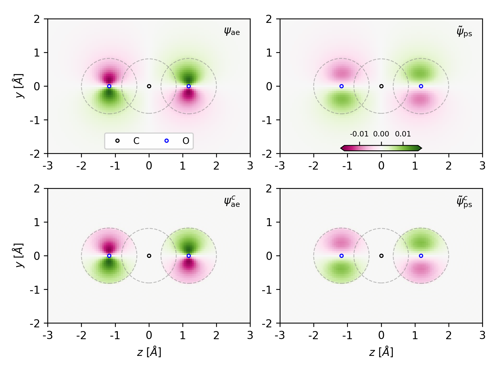
  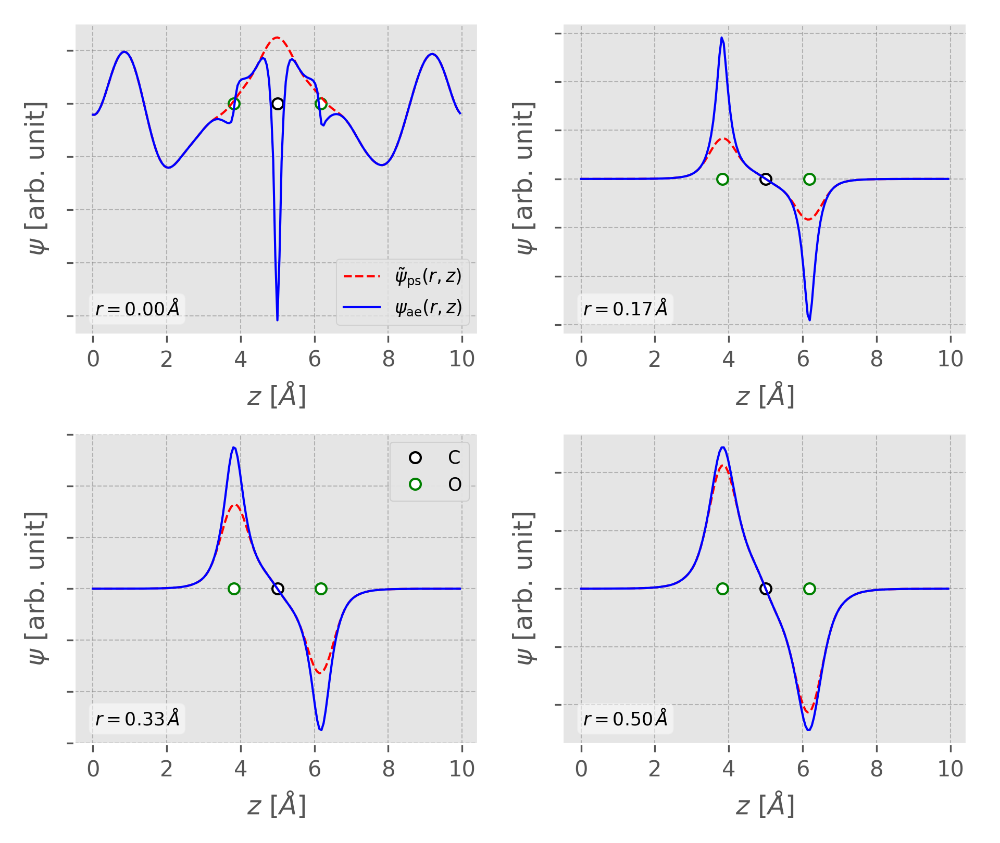

- Inverse Participation Ratio

  IPR is a measure of the localization of Kohn-Sham states. For a particular KS state \phi_j, it is defined as

  ```latex
                  \sum_n |\phi_j(n)|^4 
  IPR(\phi_j) = -------------------------
                |\sum_n |\phi_j(n)|^2||^2
  ```

  where n iters over the number of grid points.

- Electron Localization Function
  (Still need to be tested!)

  In quantum chemistry, the electron localization function (ELF) is a measure of the likelihood of finding an electron in the neighborhood space of a reference electron located at a given point and with the same spin. Physically, this measures the extent of spatial localization of the reference electron and provides a method for the mapping of electron pair probability in multielectronic systems. (from wiki)
  
  * Nature, 371, 683-686 (1994)
  * Becke and Edgecombe, J. Chem. Phys., 92, 5397(1990)
  * M. Kohout and A. Savin, Int. J. Quantum Chem., 60, 875-882(1996)
  * http://www2.cpfs.mpg.de/ELF/index.php?content=06interpr.txt
  
  NOTE that if you are using VESTA to view the resulting ELF file, please rename the output file as "ELFCAR", otherwise there will be some error in the isosurface plot!  When VESTA read in CHG*/PARCHG/*.vasp to visualize isosurfaces and sections, data values are divided by volume in the unit of bohr^3.  The unit of charge densities input by VESTA is, therefore, bohr^−3.  For LOCPOT/ELFCAR files, volume data are kept intact.

  ```python
  #/usr/bin/env python
  import numpy as np
  from vaspwfc import vaspwfc, save2vesta
  
  kptw = [1, 6, 6, 6, 6, 6, 6, 12, 12, 12, 6, 6, 12, 12, 6, 6]
  
  pswfc = vaspwfc('./WAVECAR')
  # chi = wfc.elf(kptw=kptw, ngrid=wfc._ngrid * 2)
  chi = pswfc.elf(kptw=kptw, ngrid=[20, 20, 150])
  save2vesta(chi[0], lreal=True, poscar='POSCAR', prefix='elf')
  ```
  **Remember to rename the output file "elf_r.vasp" as "ELFCAR"!**

### VASP POTCAR

The `paw.py` contains method to parse the PAW POTCAR (`pawpotcar` class) can
calculate relating quantities in the PAW within augment sphere. For example,

```python
from paw import pawpotcar

pp = pawpotcar(potfile='POTCAR')

# Q_{ij} = < \phi_i^{AE} | \phi_j^{AE} > -
#          < \phi_i^{PS} | \phi_j^{PS} >
Qij = pp.get_Qij()
# nabla_{ij} = < \phi_i^{AE} | nabla_r | \phi_j^{AE} > -
#              < \phi_i^{PS} | nabla_r | \phi_j^{PS} >
Nij = pp.get_nablaij()
```

A helping script utilizing the `paw.py` in the `bin` directory can be used to
visulize the projector function and partial waves.

```bash
# `Ti` POTCAR for exampleTCAR for example
potplot -p POTCAR   
```
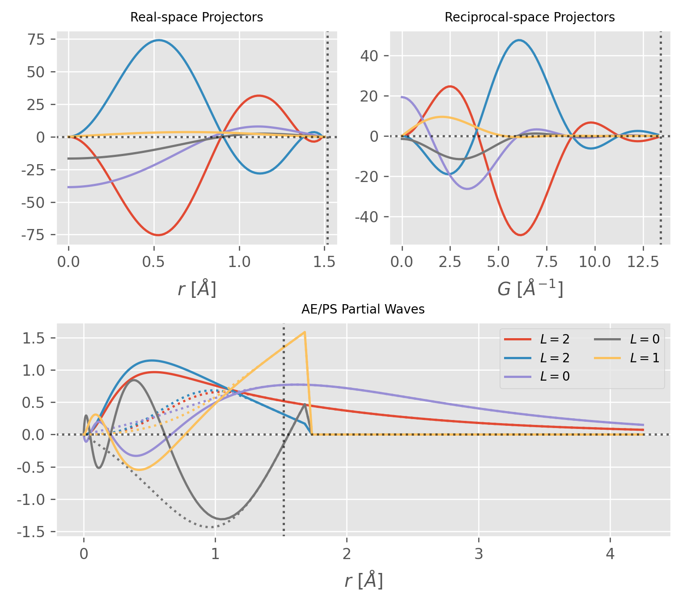

As the name suggests, `paw.py` also contains the methods (`nonlq` and `nonlr`
class) to calculate the inner products of the projector function and the
pseudo-wavefunction. The related formula can be found in [my
post](https://qijingzheng.github.io/posts/VASP-All-Electron-WFC/).

> [PAW All-Electron Wavefunction in VASP](https://qijingzheng.github.io/posts/VASP-All-Electron-WFC/)

### Band unfolding

Using the pseudo-wavefunction from supercell calculation, it is possible to
perform electronic band structure unfolding to obtain the effective band
structure. For more information, please refer to the following article and the
[GPAW](https://wiki.fysik.dtu.dk/gpaw/tutorials/unfold/unfold.html) website.

> V. Popescu and A. Zunger Extracting E versus k effective band structure
> from supercell calculations on alloys and impurities Phys. Rev. B 85, 085201
> (2012)

Theoretical background with an example can be found in my post:

> [Band Unfolding Tutorial](http://QijingZheng.github.io/posts/Band-unfolding-tutorial/)

Here, we use MoS<sub>2</sub> as an example to illustrate the procedures of band
unfolding.  Below is the band structure of MoS2 using a primitive cell. The
calculation was performed with `VASP` and the input files can be found in the
`examples/unfold/primitive`

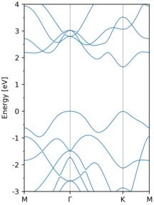

1. Create the supercell from the primitive cell, in my case, the supercell is of
   the size 3x3x1, which means that the transformation matrix between supercell
   and primitive cell is 
   ```python
    # The tranformation matrix between supercell and primitive cell.
    M = [[3.0, 0.0, 0.0],
         [0.0, 3.0, 0.0],
         [0.0, 0.0, 1.0]]
   ```
2. In the second step, generate band path in the primitive Brillouin Zone (PBZ)
   and find the correspondig K points of the supercell BZ (SBZ) onto which they
   fold.

    ```python
    from unfold import make_kpath, removeDuplicateKpoints, find_K_from_k

    # high-symmetry point of a Hexagonal BZ in fractional coordinate
    kpts = [[0.0, 0.5, 0.0],            # M
            [0.0, 0.0, 0.0],            # G
            [1./3, 1./3, 0.0],          # K
            [0.0, 0.5, 0.0]]            # M
    # create band path from the high-symmetry points, 30 points inbetween each pair
    # of high-symmetry points
    kpath = make_kpath(kpts, nseg=30)
    K_in_sup = []
    for kk in kpath:
        kg, g = find_K_from_k(kk, M)
        K_in_sup.append(kg)
    # remove the duplicate K-points
    reducedK, kid = removeDuplicateKpoints(K_in_sup, return_map=True)

    # save to VASP KPOINTS
    save2VaspKPOINTS(reducedK)
    ```
3. Do one non-SCF calculation of the supercell using the folded K-points and
   obtain the corresponding pseudo-wavefunction. The input files are in
   `examples/unfold/sup_3x3x1/`. The effective band structure (EBS) and
   then be obtained by processing the WAVECAR file.

   ```python
   from unfold import unfold

   # basis vector of the primitive cell
   cell = [[ 3.1850, 0.0000000000000000,  0.0],
           [-1.5925, 2.7582909110534373,  0.0],
           [ 0.0000, 0.0000000000000000, 35.0]]

   WaveSuper = unfold(M=M, wavecar='WAVECAR')

   from unfold import EBS_scatter
   sw = WaveSuper.spectral_weight(kpath)
   # show the effective band structure with scatter
   EBS_scatter(kpath, cell, sw, nseg=30, eref=-4.01,
           ylim=(-3, 4), 
           factor=5)

   from unfold import EBS_cmaps
   e0, sf = WaveSuper.spectral_function(nedos=4000)
   # or show the effective band structure with colormap
   EBS_cmaps(kpath, cell, e0, sf, nseg=30, eref=-4.01,
           show=False,
           ylim=(-3, 4))
   ```

   The EBS from a 3x3x1 supercell calculation are shown below:

   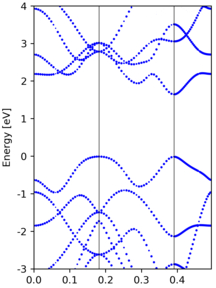 | 
   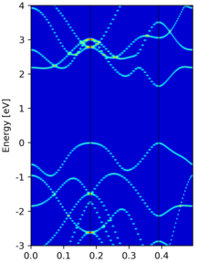
   
   Another example of EBS from a 3x3x1 supercell calculation, where we introduce a
   `S` vacancy in the structure.

   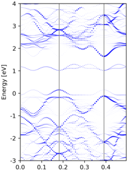 | 
   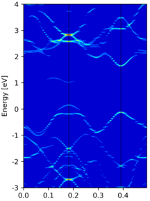

   Yet another band unfolding example from a tetragonal 3x3x1 supercell
   calculation, where the transformation matrix is

   ```python
    M = [[3.0, 0.0, 0.0],
         [3.0, 6.0, 0.0],
         [0.0, 0.0, 1.0]]
   ```
    | 
   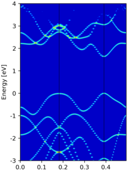

   Compared to the band structure of the primitive cell, there are some empty
   states at the top of figure. This is due to a too small value of `NBANDS` in
   supercell non-scf calculation, and thus those states are not included.

#### Band unfolding wth atomic contributions 

After band unfolding, we can also superimpose the atomic contribution of each KS
states on the spectral weight. Below is the resulting unfolded band structure of
Ce-doped bilayer-MoS2. Refer to
`./examples/unfold/Ce@BL-MoS2_3x3x1/plt_unf.py` for the entire code.

   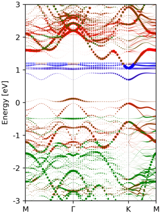

### Band re-ordering

Band re-ordering is possible by maximizing the overlap between nerghbouring
k-points. The overlap is defined as the inner product of the periodic part of
the Bloch wavefunctions.

                        `< u(n, k) | u(m, k-1) >`

Note, however, the `WAVECAR` only contains the pseudo-wavefunction, and thus the
pseudo `u(n,k)` are used in this function. Moreover, since the number of
planewaves for each k-points are different, the inner product is performed in
real space.

The overlap maximalization procedure is as follows:
1. Pick out those bands with large overlap (> olap_cut).
2. Assign those un-picked bands by maximizing the overlap.

An example band structure re-ordering is performed in MoS2. The result is shown
in the following image, where the left/right panel shows the
un-ordered/re-ordered band structure.

   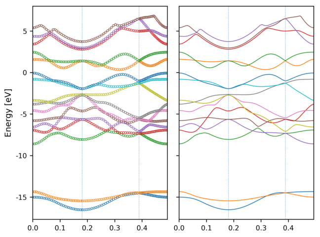 | 
