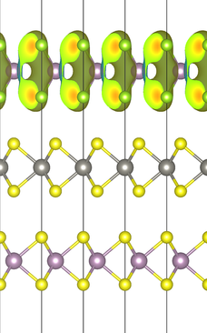

# PyVaspwfc

This is a python class for dealing with `VASP` pseudo-wavefunction file `WAVECAR`.
It can be used to extract the planewave coefficients of any single Kohn-Sham (KS)
orbital from the file.  In addition, by padding the planewave coefficients to a
3D grid and performing 3D Fourier Transform, the pseudo-wavefunction in real
space can also be obtained and saved to file that can be viewed with `VESTA`. 

With the knowledge of the planewave coefficients of the
pseudo-wavefunction,
[transition dipole moment](https://en.wikipedia.org/wiki/Transition_dipole_moment) between
any two KS states can also be calculated.

# Installation

Put `vasp_constant.py` and `vaspwfc.py` in any directory you like and add the
path of the directory to `PYTHONPATH`

```bash
export PYTHONPATH=/the/path/of/your/dir:${PYTHONPATH}
```

requirements

* numpy
* scipy

# Examples

```python
from vaspwfc import vaspwfc

wav = vaspwfc('./WAVECAR')
# KS orbital in real space, double the size of the FT grid
phi = wav.wfc_r(ikpt=2, iband=27, ngrid=wav._ngrid * 2)
# Save the orbital into files. Since the wavefunction consist of complex
# numbers, the real and imaginary part are saved separately.
wav.save2vesta(phi)
```

Below are the real (left) and imaginary (right) part of the selected KS orbital:

 | 

